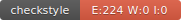

de Saxce Pierre
G2 ILSEN

La RocketPokemonFactory ne passe pas les tests correspondant aux metadata. Les noms, attaques, endurances et defenses générés sont incorrects.
Mes tests initiaux ne permettaient pas de verifier cela. J'ai donc du ajouter  des tests de vérification afin de m'assurer que les valeurs de metadata sont bien entre la valeur de base et la valeur maximum possible de ces stats (+15).
En plus de cela, la Factory fourni par la team rocket peut generer des Pokemon dont l'index est negatif ce qui devrait etre impossible.